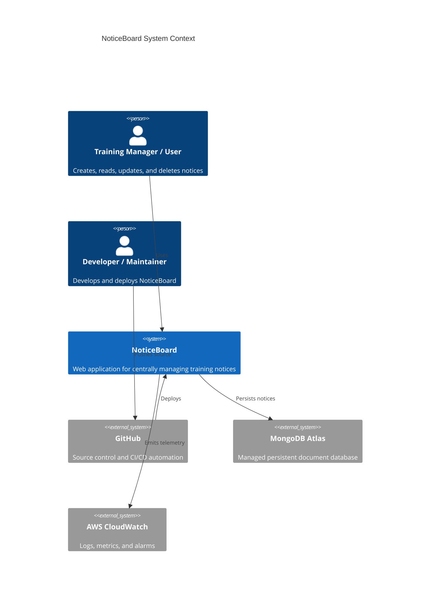
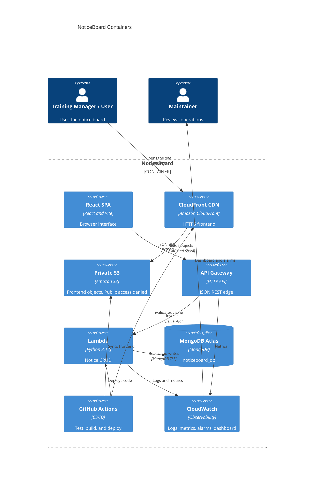
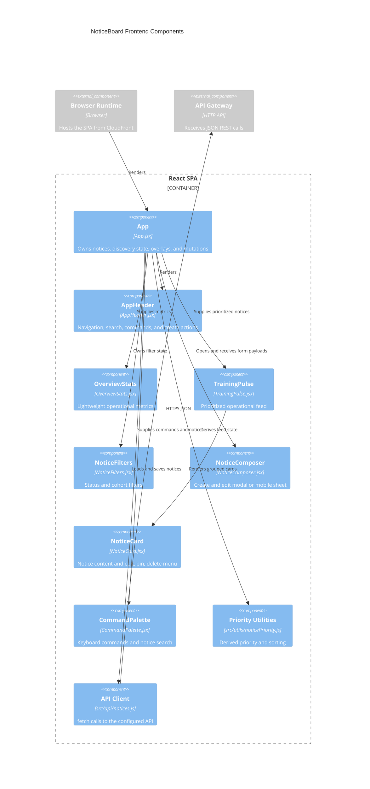
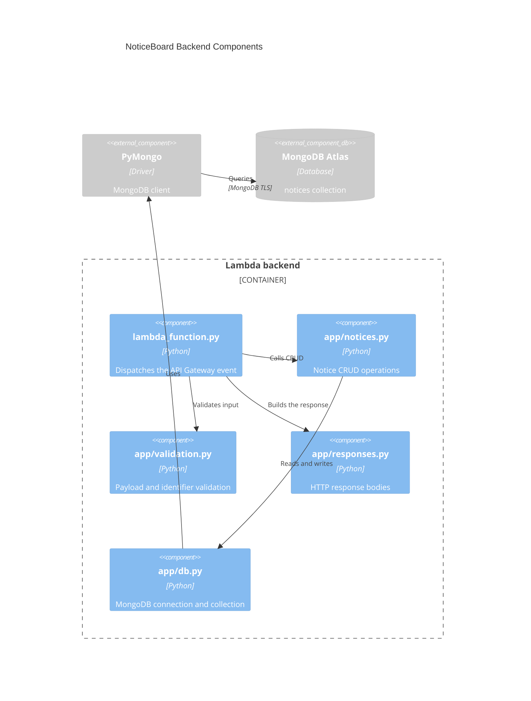
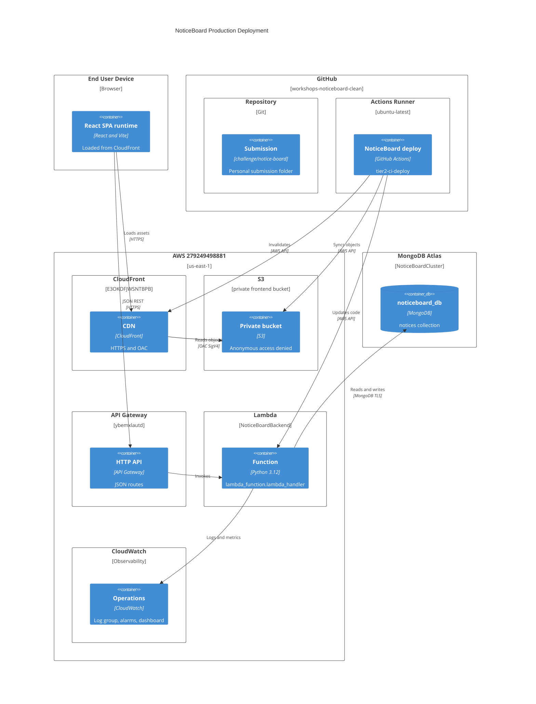
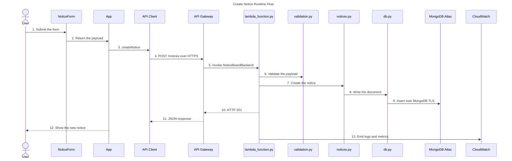
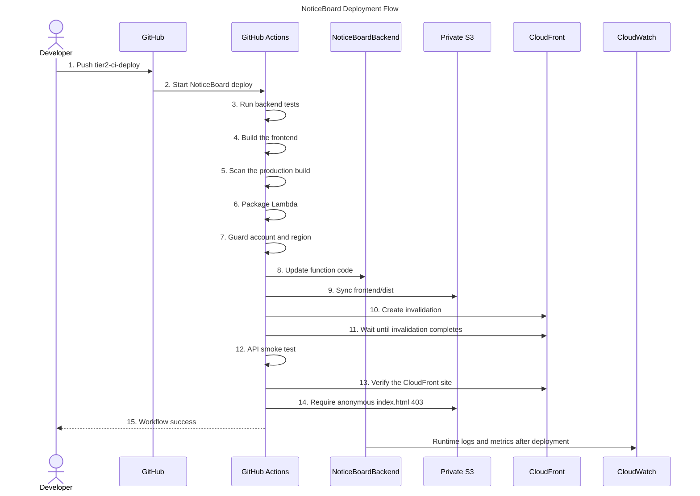

# NoticeBoard C4 architecture

These diagrams describe the deployed NoticeBoard system. PlantUML sources are in `c4/`. The diagrams below render on GitHub.

Production frontend: `https://d1s8syl3tltqh9.cloudfront.net`

CloudFront and S3 serve the SPA. API calls go from the browser to API Gateway. They do not pass through CloudFront.

## System Context

Scope: people and software systems. AWS containers are not shown at this level.

The user works in NoticeBoard. The developer works in GitHub. GitHub deploys NoticeBoard. NoticeBoard stores notices in MongoDB Atlas and sends telemetry to CloudWatch.

## Containers

Scope: runtime containers inside NoticeBoard, plus the people who use them.

Direct public S3 access is denied. CloudFront is the only public path to the frontend objects.

## Frontend components

Scope: the React SPA only.

`App` owns the notice list and the local discovery/overlay state. Training Pulse
uses `noticePriority.js` to derive local-calendar states and sort pinned notices
without persisting presentation fields. Components do not call the network
themselves; `src/api/notices.js` remains the only frontend module that calls API
Gateway.

## Backend components

Scope: the Lambda backend only.

`local_app.py` is a local FastAPI adapter. It is not part of the production Lambda container.

## Deployment

Scope: where each container runs.

## Runtime dynamic — create notice

Scope: one successful `POST /notices`. CloudFront already served the SPA. This request does not go through CloudFront or S3.

## CI/CD dynamic — deployment

Scope: one push to `tier2-ci-deploy`.

## Sources

| Diagram | PlantUML |
| --- | --- |
| System Context | `c4/01-system-context.puml` |
| Containers | `c4/02-container.puml` |
| Frontend components | `c4/03-frontend-components.puml` |
| Backend components | `c4/04-backend-components.puml` |
| Deployment | `c4/05-deployment.puml` |
| Create notice | `c4/06-runtime-create-notice.puml` |
| CI/CD | `c4/07-cicd-deployment.puml` |
